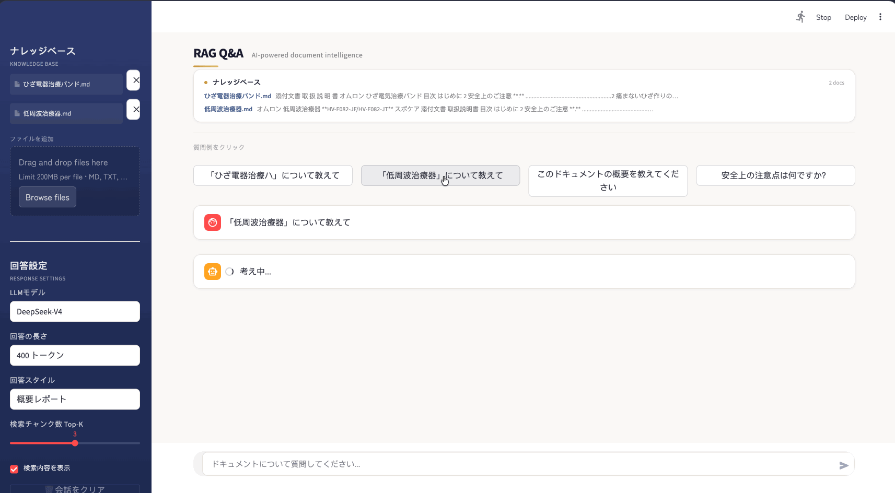
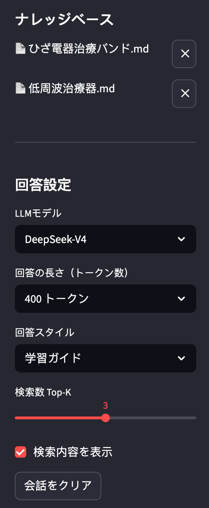

# RAG技術を利用したローカルマニュアルQAシステム

[English](README_EN.md) | [中文](README_CN.md) | 日本語

## 概要

本プロジェクトは、RAG（検索拡張生成）技術を用いて、ローカルに保存したマニュアルやドキュメントに対して自然言語で質問できるQAシステムです。埋め込みモデルに ZhipuAI API、回答生成にはコストパフォーマンスに優れた DeepSeek API を使用しています。Streamlit による Web UI を備え、ブラウザ上で直感的に操作できます。

### Web UI の主な機能

- **チャット形式の対話**：質問を入力すると、RAG が関連文書を検索し、DeepSeek が回答をストリーミング表示します。会話履歴はセッション中保持されます。
- **回答スタイル選択**：概要レポート・学習ガイド・ブログ記事・カスタム形式の4種から選択。スタイルごとに専用のプロンプトテンプレートが適用されます。カスタム形式では任意の指示を自由に入力可能です。
- **回答の長さ設定**：200 / 400 / 800 トークンから選択。`max_tokens` パラメータに反映されます。
- **検索結果の可視化**：Top-K チャンクを展開表示し、出典ファイル名・類似度スコア（コサイン類似度）・キーワードハイライトを確認できます。
- **ナレッジベース管理**：`data/` にファイルを置くだけで起動時に自動ベクトル化。Web UI から Drag & Drop での追加・削除、変更分のみを処理する増分構築に対応。
- **質問サンプル**：ナレッジベースに登録されたファイル名から自動で質問例を生成。クリックするだけで関連文書への質問が可能です。

### 実行結果





---

## 使い方

### 1. 環境構築（ワンクリックセットアップ）

Python 3.10 以上が必要です。以下のコマンドで仮想環境の作成から依存パッケージのインストールまでを一括実行できます。

**Windows (PowerShell):**
```bash
python -m venv .venv; .venv\Scripts\activate; pip install -r requirements.txt
```

**macOS / Linux:**
```bash
python3 -m venv .venv && source .venv/bin/activate && pip install -r requirements.txt
```

> `uv` を使用する場合は `uv venv .venv && uv pip install -r requirements.txt` でより高速にインストールできます。

### 2. APIキーの取得

本プロジェクトでは、埋め込み用に **ZhipuAI API**、LLM回答生成用に **DeepSeek API** を使用しています。DeepSeek は高い回答力と低価格を両立しており、コストパフォーマンスに優れています。各公式サイトでアカウント登録後、APIキーを取得し、`.env` に設定してください。

```
ZHIPUAI_API_KEY='あなたのZhipuAI APIキー'
DEEPSEEK_API_KEY='あなたのDeepSeek APIキー'
```

### 3. データの準備

`data/` ディレクトリに質問対象の `.md` / `.txt` / `.pdf` ファイルを配置してください。


### 4. 起動

```bash
streamlit run app.py --server.port 8501
```

ブラウザで `http://localhost:8501` を開くと、チャット画面が表示されます。サイドバーからスタイルや長さを設定し、質問を入力してください。

---

## RAGの仕組み

RAG（Retrieval-Augmented Generation）は、以下の3ステップで動作します。

1. **Retrieve（検索）**：ユーザーの質問をベクトル化し、知識ベース内の文書断片（チャンク）からコサイン類似度で最も関連性の高いものを Top-K 件取得します。
2. **Augment（拡張）**：検索結果をコンテキストとしてプロンプトに埋め込み、LLM に渡します。
3. **Generate（生成）**：LLM がコンテキストを参照しながら回答を生成します。モデルが直接学習していない情報にも対応可能です。


*Image from https://blog-ja.allganize.ai/allganize_rag-1/*


---

## コード実行例

Python スクリプトから直接 RAG を利用する場合の流れです。

```python
from RAG.VectorBase import VectorStore
from RAG.utils import ReadFiles
from RAG.Embeddings import ZhipuEmbedding
from RAG.LLM import DeepSeekAIChat

# ドキュメントを読み込み、分割
docs, sources = ReadFiles('./data').get_content(max_token_len=600, cover_content=150)

# ベクトル化して保存
vector = VectorStore(docs, sources)
vector.get_vector(EmbeddingModel=ZhipuEmbedding())
vector.persist(path='storage')

# 保存済みベクトルを読み込み、質問に回答
vector = VectorStore()
vector.load_vector('./storage')

question = '低周波治療器の使い方は？'
content = vector.query(question, EmbeddingModel=ZhipuEmbedding(), k=1)

chat = DeepSeekAIChat(model='deepseek-chat')
print(chat.chat(question, [], content[0]['text']))
```


---

## 実装の詳細

### ベクトル化（Embeddings）

`zhipu` / `jina` / `openai` の3種類の埋め込みモデルに対応。他のモデルを追加する場合は `BaseEmbeddings` を継承して `get_embedding()` を実装してください。

```python
class BaseEmbeddings:
    def __init__(self, path: str, is_api: bool) -> None:
        self.path = path
        self.is_api = is_api

    def get_embedding(self, text: str, model: str) -> List[float]:
        raise NotImplementedError

    @classmethod
    def cosine_similarity(cls, vector1, vector2) -> float:
        dot_product = np.dot(vector1, vector2)
        magnitude = np.linalg.norm(vector1) * np.linalg.norm(vector2)
        return 0 if not magnitude else dot_product / magnitude
```

### ベクトル検索（VectorBase）

文書断片とベクトルを JSON でローカル保存し、Numpy でコサイン類似度を計算。軽量で理解しやすい実装です。

```python
def query(self, query, EmbeddingModel, k=1):
    query_vector = EmbeddingModel.get_embedding(query)
    scores = np.array([self.get_similarity(query_vector, v) for v in self.vectors])
    top_indices = scores.argsort()[-k:][::-1]
    return [{"text": self.document[i], "score": float(scores[i]), "source": self.sources[i]}
            for i in top_indices]
```

> 本実装は学習目的です。本番環境では専用のベクトルデータベース（Chroma、Pinecone 等）の使用を推奨します。

### LLM モデル

OpenAI / InternLM2 / ZhipuAI / DeepSeek に対応。他のモデルを追加する場合は `BaseModel` を継承してください。

```python
class BaseModel:
    def __init__(self, path: str = '') -> None:
        self.path = path

    def chat(self, prompt: str, history: List[dict], content: str) -> str:
        pass

    def load_model(self):
        pass
```

---

## Reference

<details><summary>Expand</summary>

| Name | Link |
|------|------|
| Hand-on-RAG | https://github.com/SmartFlowAI/Hand-on-RAG |
| When Large Language Models Meet Vector Databases: A Survey | http://arxiv.org/abs/2402.01763 |
| Retrieval-Augmented Generation for Large Language Models: A Survey | https://arxiv.org/abs/2312.10997 |
| Learning to Filter Context for Retrieval-Augmented Generation | http://arxiv.org/abs/2311.08377 |
| In-Context Retrieval-Augmented Language Models | https://arxiv.org/abs/2302.00083 |

</details>
