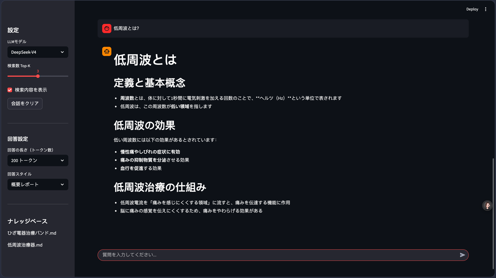
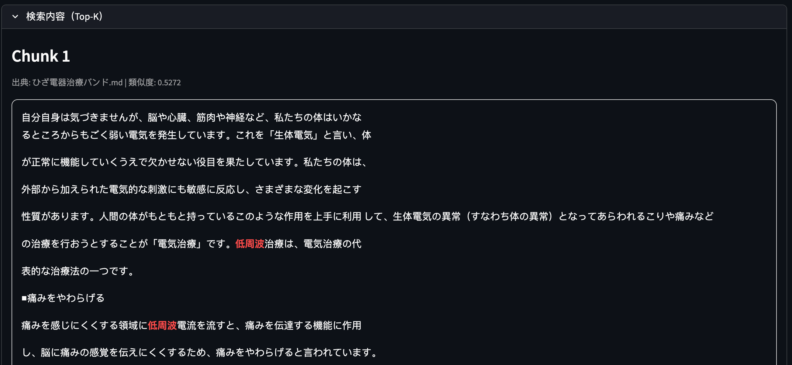
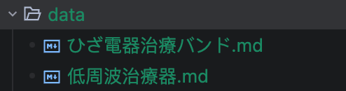
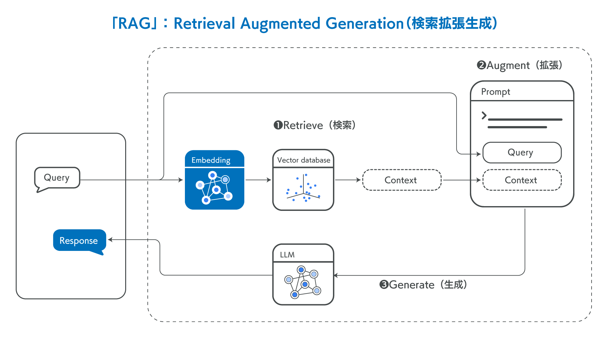
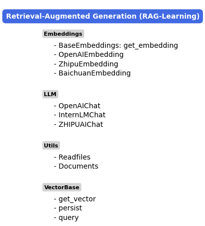

# RAG-Powered Local Manual QA System

[日本語](README.md) | [中文](README_CN.md) | English

## Overview

This project is a QA system that lets you ask natural-language questions about locally stored manuals and documents using RAG (Retrieval-Augmented Generation). It uses the ZhipuAI API for embeddings and the DeepSeek API — known for its high performance at a low cost — for answer generation. A Streamlit web UI provides an intuitive browser-based experience.

### Web UI Features

- **Chat-style interaction**: Type a question, and the system retrieves relevant documents via RAG, then DeepSeek streams the answer in real time. Conversation history is preserved across the session.
- **Answer style selection**: Choose from four styles — Summary Report, Study Guide, Blog Post, and Custom. Each style uses a dedicated prompt template. In Custom mode, you can freely enter any formatting instruction.
- **Answer length control**: Select 200 / 400 / 800 tokens. This is passed directly to the `max_tokens` parameter.
- **Search result visualization**: Retrieved Top-K chunks are displayed in an expandable area, showing the source filename, cosine similarity score, and keyword highlighting.
- **Knowledge base management**: Simply place `.md` / `.txt` / `.pdf` files in the `data/` directory — they are automatically vectorized on startup.

### Results





---

## Getting Started

### 1. Environment Setup (One-Click Setup)

Python 3.10+ is required. Run the command below to create a virtual environment and install all dependencies in one step.

**Windows (PowerShell):**
```bash
python -m venv .venv; .venv\Scripts\activate; pip install -r requirements.txt
```

**macOS / Linux:**
```bash
python3 -m venv .venv && source .venv/bin/activate && pip install -r requirements.txt
```

> If you use `uv`, run `uv venv .venv && uv pip install -r requirements.txt` for a faster setup.

### 2. API Keys

This project uses the **ZhipuAI API** for embeddings and the **DeepSeek API** for LLM answer generation. DeepSeek offers excellent answer quality at a low price. Register on each platform's official site, obtain your API keys, and add them to the `.env` file:

```
ZHIPUAI_API_KEY='your ZhipuAI API key'
DEEPSEEK_API_KEY='your DeepSeek API key'
```

### 3. Prepare Your Data

Place `.md` / `.txt` / `.pdf` files in the `data/` directory.



### 4. Launch

```bash
streamlit run app.py --server.port 8502
```

Open `http://localhost:8502` in your browser. Configure the style and length from the sidebar, then start asking questions.

---

## How RAG Works

RAG operates in three steps:

1. **Retrieve**: The user's question is vectorized, and the most relevant document chunks are fetched from the knowledge base via cosine similarity (Top-K).
2. **Augment**: The retrieved results are embedded into the prompt as context and passed to the LLM.
3. **Generate**: The LLM generates an answer referencing the context, enabling responses to topics the model was not directly trained on.


*Image from https://blog-ja.allganize.ai/allganize_rag-1/*



---

## Code Example

Using RAG directly from a Python script:

```python
from RAG.VectorBase import VectorStore
from RAG.utils import ReadFiles
from RAG.Embeddings import ZhipuEmbedding
from RAG.LLM import ZhipuAIChat

# Load and split documents
docs, sources = ReadFiles('./data').get_content(max_token_len=600, cover_content=150)

# Vectorize and persist
vector = VectorStore(docs, sources)
vector.get_vector(EmbeddingModel=ZhipuEmbedding())
vector.persist(path='storage')

# Load saved vectors and answer a question
vector = VectorStore()
vector.load_vector('./storage')

question = 'What is the accuracy of the multi-channel dispenser?'
content = vector.query(question, EmbeddingModel=ZhipuEmbedding(), k=1)

chat = ZhipuAIChat(model='chatglm_lite')
print(chat.chat(question, [], content[0]['text']))
```

---

## Implementation Details

### Embeddings

Supports three embedding models: `zhipu` / `jina` / `openai`. To add a new model, inherit `BaseEmbeddings` and implement `get_embedding()`.

```python
class BaseEmbeddings:
    def __init__(self, path: str, is_api: bool) -> None:
        self.path = path
        self.is_api = is_api

    def get_embedding(self, text: str, model: str) -> List[float]:
        raise NotImplementedError

    @classmethod
    def cosine_similarity(cls, vector1, vector2) -> float:
        dot_product = np.dot(vector1, vector2)
        magnitude = np.linalg.norm(vector1) * np.linalg.norm(vector2)
        return 0 if not magnitude else dot_product / magnitude
```

### Vector Search (VectorBase)

Document chunks and their vectors are stored locally as JSON. Cosine similarity is computed with Numpy — a lightweight and easy-to-understand implementation.

```python
def query(self, query, EmbeddingModel, k=1):
    query_vector = EmbeddingModel.get_embedding(query)
    scores = np.array([self.get_similarity(query_vector, v) for v in self.vectors])
    top_indices = scores.argsort()[-k:][::-1]
    return [{"text": self.document[i], "score": float(scores[i]), "source": self.sources[i]}
            for i in top_indices]
```

> This implementation is for educational purposes. For production, consider using a dedicated vector database (Chroma, Pinecone, etc.).

### LLM Models

Supports OpenAI / InternLM2 / ZhipuAI / DeepSeek. To add a new model, inherit `BaseModel`.

```python
class BaseModel:
    def __init__(self, path: str = '') -> None:
        self.path = path

    def chat(self, prompt: str, history: List[dict], content: str) -> str:
        pass

    def load_model(self):
        pass
```

---

## Reference

<details><summary>Expand</summary>

| Name | Link |
|------|------|
| Hand-on-RAG | https://github.com/SmartFlowAI/Hand-on-RAG |
| When Large Language Models Meet Vector Databases: A Survey | http://arxiv.org/abs/2402.01763 |
| Retrieval-Augmented Generation for Large Language Models: A Survey | https://arxiv.org/abs/2312.10997 |
| Learning to Filter Context for Retrieval-Augmented Generation | http://arxiv.org/abs/2311.08377 |
| In-Context Retrieval-Augmented Language Models | https://arxiv.org/abs/2302.00083 |

</details>
